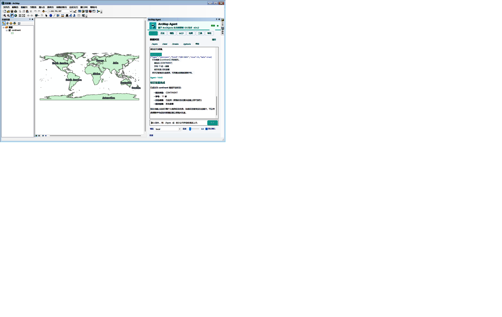

# ArcMap Agent v0.4.3 —— 安装说明

> 在 ArcMap 里用大白话干活。
> 打开面板，敲一句「把规划用地那个图层按面积做个分级配色」，它自己调工具、自己跑完。

---

## 一、这是个什么东西

一个 ArcMap 的插件（Add-In）。装完之后 ArcMap 里会多出一个工具条和一个停靠面板：

- **对话干活**：你说人话，它拆成 ArcObjects 操作去执行（加图层、查属性、按属性/位置选择、分级配色、出图、存文档……）
- **28 个内置工具 + 90 条 GP 工具目录**：常用的地图操作都能直接调，也能自己拼 GP 工具链
- **能接各种模型**：云端（OpenAI / DeepSeek / 智谱 GLM / 通义千问）或本地（vLLM / Ollama），哪个都行
- **可以当 MCP 服务端**：让 Claude Desktop、Cursor 这类外部 Agent 直接操作你当前的 ArcMap

**只支持 ArcMap，不支持 ArcGIS Pro。** 这两个是完全不同的架构。

---

## 二、装之前先对一下环境

| 项目 | 要求 |
| --- | --- |
| 操作系统 | Windows 7 SP1 / 10 / 11 |
| ArcGIS Desktop | **10.2 – 10.8**（本包在 10.4.1 上编译并测试） |
| ArcMap | 32 位版本（ArcGIS Desktop 官方就只有 32 位） |
| .NET Framework | **4.8**。Windows 10 1903 及以后、Windows 11 都自带；老系统需要自己装一下 |
| 模型服务 | 可选。云端要一个 API Key，本地要一个推理服务地址。**装完再配也来得及** |

> 关于 ArcGIS 版本：本包用 10.4 的 SDK 编译，目标框架写的是 10.0，所以 10.2–10.8 理论上都能加载。
> 如果你用的是 10.8 且遇到问题，告诉我，我用对应版本 SDK 重编一份。

---

## 三、安装（三种方式，任选一种）

### 方法一：双击安装（推荐，最省事）

双击 **`ArcMapAgent.esriaddin`** → 弹出 ESRI 的加载项安装向导 → 点 **Install** → 完成。

### 方法二：一键脚本

1. **先关掉所有 ArcMap 窗口**
2. 双击 **`一键安装.bat`**
3. 看到「安装完成」就行了

这个脚本会自动找你的 ArcGIS 版本、自动定位 Documents 目录（兼容 OneDrive 重定向的情况）、顺手清掉旧缓存。

### 方法三：手动复制

把 `ArcMapAgent.esriaddin` 复制到下面这个目录（没有就自己新建）：

```
%USERPROFILE%\Documents\ArcGIS\AddIns\Desktop10.4\{6F3A9C52-8B14-4E2D-9A7B-1D5C0E4F83A6}\
```

`Desktop10.4` 要换成你实际装的版本（`Desktop10.2`、`Desktop10.5`、`Desktop10.8` 这样）。

---

## 四、第一次打开

1. **重启 ArcMap**（这一步别省，插件是启动时加载的）
2. 菜单栏空白处 **右键** → 勾选 **ArcMap Agent** 工具条
   （或者走菜单：自定义 → 工具条 → 勾 ArcMap Agent）
3. 点工具条上那个按钮，右侧就出现 ArcMap Agent 面板了



面板一共 7 个页签：

| 页签 | 干什么的 |
| --- | --- |
| **对话** | 主要工作区。输入指令，看它调工具、执行、回话 |
| **历史** | 会话自动存盘，可以保存 / 载入 / 删除 |
| **模型** | 配模型：端点、模型名、API Key，带连接测试和一键填预设 |
| **MCP** | 把 ArcMap 的能力暴露给外部 Agent（端口、令牌、特权开关、连通性自检） |
| **地图** | 当前文档的图层、数据框、书签一览 |
| **工具** | 查看 / 试跑那 28 个工具，能看参数表 |
| **帮助** | 内置说明书和 slash 命令清单 |

---

## 五、配一个模型（三分钟）

打开 **模型** 页：

1. 点 **「＋ 添加」**（或者直接选一个厂商预设：OpenAI / DeepSeek / GLM / 通义 / 本地 vLLM / Ollama）
2. 填三样东西：
   - **API 端点**：OpenAI 兼容格式，本地 vLLM 默认是 `http://localhost:8000/v1`
   - **模型名**：按你实际部署的名字填，比如 `Qwen2.5-7B-Instruct`
   - **API Key**：本地服务一般留空；云端 API 填你自己的密钥
3. 点 **测试连接**，出现绿色的连通提示就成了

配置会存到 `%APPDATA%\ArcMapAgent\config.json`。

> **关于密钥安全**：Key 只存在你自己机器的这个文件里，插件不会往任何第三方服务器发送它。
> 但如果要发配置给别人，记得先把 Key 抹掉。

---

## 六、先试试不花钱的命令

**在配模型之前**，你可以先用 slash 命令验证插件本身跑没跑通 —— 这些命令**不调用大模型**，纯本地执行：

| 命令 | 作用 |
| --- | --- |
| `/help` | 看全部命令 |
| `/layers` | 列出当前文档所有图层 |
| `/info` | 当前图层的信息 |
| `/fields` | 看字段列表 |
| `/count` | 要素数量 |
| `/extent` | 当前视图范围 |
| `/zoom` `/full` | 缩放、全图显示 |
| `/query` `/where` | 属性查询 |
| `/sel` `/selwhere` | 选择要素 |
| `/breaks` `/color` | 分级方法、配色 |
| `/label` `/unlabel` | 标注开关 |
| `/export` | 导出地图 |
| `/gptools` | 打出 GP 工具目录 |
| `/mcp` | MCP 服务状态 |

敲 `/layers` 能打出图层列表，说明插件链路完全正常，接着配模型就行。

---

## 七、正式开始用

配好模型之后，直接在输入框说人话，比如：

- 「当前文档里有哪些图层？」
- 「把 `roads` 图层里道路等级是高架的都选中」
- 「选中范围裁一下，导出成 shapefile 到桌面」
- 「按 `POP` 字段做成 5 级分位数配色」
- 「在 `PARCEL` 的 `OWNER` 字段上标注，字号 10」
- 「跑一个缓冲区分析，半径 500 米」

它会自己决定调哪些工具、按什么顺序调，然后把结果告诉你。一次说不清就接着聊，多轮是支持的。

> 支持 function calling 的模型效果最好。不支持的模型会退化成普通对话（能聊，但不能真动手）。

---

## 八、可选：让 Claude / Cursor 也能操作你的 ArcMap

1. 面板 → **MCP** 页 → 点 **启动服务**（默认监听 `127.0.0.1:9876`，只对本机开放）
2. 点 **复制客户端配置**
3. 把复制到的 JSON 贴进 Claude Desktop 的 `claude_desktop_config.json`（或 Cursor 的 MCP 设置）

参考格式（`MCP-外部接入示例.json` 里也有一份）：

```json
{
  "mcpServers": {
    "arcmap-agent": {
      "url": "http://127.0.0.1:9876/mcp",
      "headers": { "X-Auth-Token": "<在 MCP 页复制的令牌>" }
    }
  }
}
```

令牌每次安装都会随机生成，在 MCP 页能直接看到。**改地图 / 写盘那三个危险工具默认关着**，要开需要显式勾选。

---

## 九、卸载

- 走界面：ArcMap → 自定义 → **加载项管理器** → 选中 ArcMap Agent → 删除
- 或者直接删掉这个目录：
  `%USERPROFILE%\Documents\ArcGIS\AddIns\Desktop10.4\{6F3A9C52-8B14-4E2D-9A7B-1D5C0E4F83A6}\`

想顺手清干净的话，再删这两个（下次会自动重建）：

```
%LOCALAPPDATA%\ESRI\Desktop10.4\AssemblyCache\{6F3A9C52-8B14-4E2D-9A7B-1D5C0E4F83A6}\
%APPDATA%\ArcMapAgent\
```

---

## 十、遇到问题了

### 面板打不开 / 点按钮没反应

八成是旧缓存在作怪。按顺序试：

1. 彻底**关掉 ArcMap**，重新打开
2. 还不行，就删掉这个目录再重启 ArcMap（它会自动重新解包）：
   `%LOCALAPPDATA%\ESRI\Desktop10.4\AssemblyCache\{6F3A9C52-8B14-4E2D-9A7B-1D5C0E4F83A6}\`
3. 想看它到底为什么没起来，看这个文件：
   `%APPDATA%\ArcMapAgent\ext.diag` —— 里面是加载期的逐步诊断日志，直接把内容发我

### 找不到工具条

菜单栏右键 → 自定义 → 工具条 → 勾 **ArcMap Agent**。
还找不到就是没装上，回到第三步重装一次。

### 文字发糊 / 按钮没对齐

这两个问题在 **v0.4.3 已经修掉了**。如果你装的是更早的版本，换这个包。
（顺带说明：这版把按钮标题改成直接画到窗口而不是先画进缓冲位图，就是为了让它在高 DPI 屏上清晰。）

### 模型连不上

1. 先在浏览器 / curl 里直接打一下你的端点，确认服务本身是活的
2. 检查端点地址是不是少了 `/v1`
3. 云端 API 检查 Key 有没有过期、额度够不够
4. 本机装了 HTTP 代理的话要留意，有些代理会拦本地回环请求

### 提示需要 .NET Framework

去装 **.NET Framework 4.8 Runtime**（微软官网免费下载，装完重启）。

---

## 附：这个包里有什么

```
ArcMapAgent_v0.4.3/
├── ArcMapAgent.esriaddin      ← 插件本体，要装的就是它（约 106 KB）
├── 安装说明.md                 ← 你正在看的这份
├── 一键安装.bat                ← 备选安装方式
├── MCP-外部接入示例.json        ← Claude / Cursor 接入用的配置模板
├── 版本更新说明.md              ← 改动记录
└── images/
    ├── screenshot-panel.png   ← 面板截图
    └── logo.png               ← 图标
```

**同时装多个版本？** 不用管 —— 同一个 AddInID，新包装上去会覆盖旧的，不会共存。

---

*ArcMap Agent v0.4.3 · 2026-10 · 有问题把 `%APPDATA%\ArcMapAgent\panel.log` 和 `ext.diag` 一起发我*
